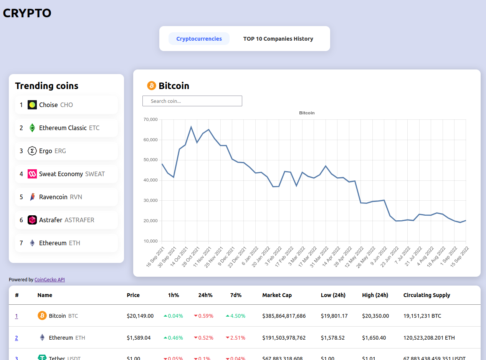
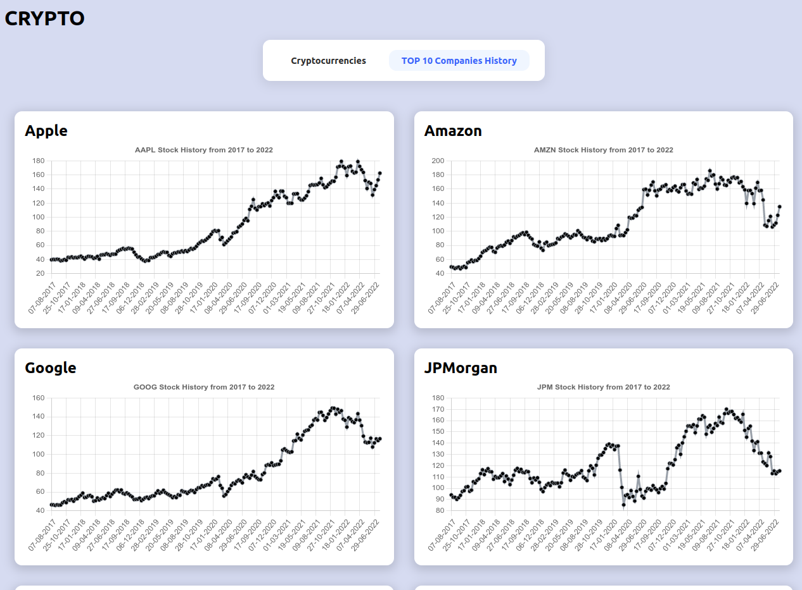

# Crypto

A web app to display live crypto data and also stock market history for the TOP 10 companies between 2017 and 2022.

(Still in development)

## How to use locally

Clone the repository on your local machine.

Go into the new directory (most likely its name will be crypto)

Run npm install and then npm run dev (if this doesn't work, search for the command to start the project on package.json)

## Screenshots

## About the author

I'm [Dario Aladuz](https://github.com/darioaladuz), a Full Stack Web Developer. I've been programming for more than 3 years now and currently working on personal projects, and looking for a job position.

### License

MIT License